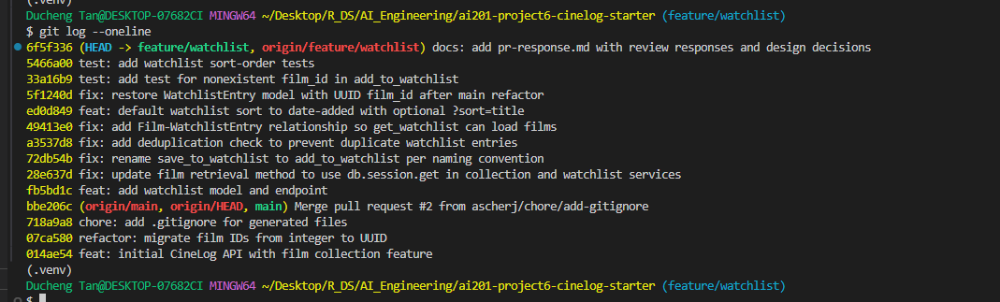

# PR Response Doc — CineLog Watchlist Feature

## AI Usage
I used an AI assistant (Claude) throughout this project in the following specific ways:

- **Codebase orientation.** I asked it to summarize `models.py`, `services/collection_service.py`,
  and `tests/test_collection.py` so I understood the existing naming convention, the
  `add_to_collection()` deduplication pattern, and the fixture/assertion structure before I
  started changing anything. I verified each summary against the actual code.
- **Understanding a pattern (Comment 2).** I had it walk me through what
  `add_to_collection()`'s duplicate check returns so I could write my own equivalent check in
  `add_to_watchlist()` rather than copy it blindly.
- **Git mechanics.** I used it to understand and safely execute the rebase onto the UUID
  `main` (Comment 6) and the final interactive rebase that cleaned up my commit history —
  including confirming my messages follow the conventional-commit spec and that no merge
  commits remained.
- **Design decisions (Comments 4 and 5).** The positions and reasoning are my own. For
  Comment 4 (visibility) I wrote the argument myself and used the AI only as a devil's
  advocate — I asked "what counterargument would a reviewer raise?" and confirmed my
  privacy-first reasoning held up. For Comment 5 (sort order) I decided the position
  (date-added default plus an opt-in `?sort=` parameter) and gave my reasons; the AI helped
  me structure and word that reasoning into the written response, which I then reviewed and
  approved. I also had it stress-test the argument, which surfaced the "scope creep"
  counterpoint that I then addressed directly in my answer.
- **Bug discovery.** While adding the sort tests, the AI-run test suite surfaced a
  pre-existing bug: `get_watchlist()` referenced `entry.film`, but `Film` had no relationship
  to `WatchlistEntry`. I fixed it by mirroring the collection service's relationship.

<!-- NOTE: review this section and adjust it to match your own honest recollection before submitting. -->


## Comment 1 — Rename
**What I did:**
Renamed `save_to_watchlist()` to `add_to_watchlist()` in `services/watchlist_service.py`
to match the naming convention already used by `add_to_collection()` in the collection
service. Updated the one call site in `routes/watchlist/watchlist.py` — both the `import`
line and the call inside the `add_film` endpoint.

**How I verified:**
Ran a project-wide search for the old name `save_to_watchlist` to confirm no other call
sites remained (only the import and the call in `routes/watchlist/watchlist.py` referenced
it, and both are updated). Confirmed the app still imports cleanly and the full test suite
passes with `pytest tests/ -v`.

## Comment 2 — Deduplication
**What I did:**
Followed the exact pattern used by `add_to_collection()` in `services/collection_service.py`:
- Added an `AlreadyInWatchlistError` exception class at the top of
  `services/watchlist_service.py`, mirroring `AlreadyInCollectionError`.
- In `add_to_watchlist()`, after the film-exists check, I query for an existing
  `WatchlistEntry` with the same `user_id` and `film_id` using
  `filter_by(...).first()`. If one exists, I raise `AlreadyInWatchlistError` before
  creating a new entry.
- Documented the new exception in the function's `Raises:` docstring section.
- Updated the route (`routes/watchlist/watchlist.py`) to catch the new exception and
  return **409 Conflict**, and to catch `FilmNotFoundError` and return **404** — matching
  the collection endpoint. Without this, a duplicate add would surface as a 500 crash
  instead of a clean 409.

**How I verified:**
I based the check on `add_to_collection()`, which returns the *existing entry lookup*
as `None` when there's no duplicate and a truthy `CollectionEntry` when there is — so the
`if existing:` branch only triggers on a real duplicate. Ran `pytest tests/ -v`; all 4
existing tests still pass, confirming the added logic and route error-handling didn't
break the happy path.

## Comment 3 — Missing test
**What I did:**
Created `tests/test_watchlist.py`, modeled directly on
`test_add_to_collection_nonexistent_film_raises` in `tests/test_collection.py`. I reused
the same three fixtures (`app` with an in-memory SQLite DB, `sample_user`, `sample_film`)
and added `test_add_to_watchlist_nonexistent_film_raises`, which calls `add_to_watchlist()`
with a film_id that isn't in the database and asserts it raises `FilmNotFoundError` (via
`pytest.raises`) rather than a database integrity error. `FilmNotFoundError` is imported
from `services.collection_service`, matching how the watchlist service itself imports it.

**How I verified:**
Ran `pytest tests/test_watchlist.py -v` — the new test passes. Then ran the full suite
`pytest tests/ -v`; all 5 tests pass (4 collection + 1 watchlist), confirming the new file
integrates cleanly and nothing else regressed.

## Comment 4 — Default visibility
**My position:** My position is that private should be the default setting.

**Reasoning:** This is in order to optimize for privacy and the user's trust in the system. However, I do believe that every time a film is saved there should be a small pop-up available for the user to save the film as either public or private. To me it feels that once something is out on the internet it is almost impossible to trace back and delete completely without a trace, so I believe the user should always be reminded of the decision.

**Tradeoff acknowledged:** The obvious tradeoff is that certain users may only have private films saved, which undermines the purpose of this being a community app in the first place. Some accounts and profiles on the app will remain empty as a result.

## Comment 5 — Sort order
**My position:** I agree with the maintainer that the watchlist should default to
date-added (newest first), and I also added a caller-specified `?sort=` option so a user
can switch to alphabetical when they need to. I changed the default in `get_watchlist()`
from `Film.title.asc()` to `WatchlistEntry.date_added.desc()`, and added a `sort` argument
(`"date"` default, `"title"` for alphabetical) that the GET endpoint reads from the query
string (`GET /watchlist/<user_id>?sort=title`).

**Reasoning:** Date-added first is the better default for two reasons. First, consistency:
`get_collection()` already sorts newest-first, so a user's collection and watchlist now
behave the same way instead of one being chronological and the other alphabetical. Second,
a watchlist is a "what do I want to watch next" list — people tend to remember roughly
*when* they added something ("that film I saved last week"), so surfacing recent additions
first matches how they actually look for things. But alphabetical still has a real use:
once a watchlist gets long, finding one specific title by scrolling a date-ordered list is
painful. Rather than throw that away, I exposed it as an opt-in sort the user can switch to.

**Engagement with reviewer's point:** The maintainer's core argument — consistency with the
collection and recency mattering more than the alphabet — is correct, and I adopted it as
the default. Where I go further is that I don't think it's an either/or choice. Alphabetical
isn't wrong; it's just the wrong *default*. Making it a query parameter keeps the maintainer's
preferred behavior for the common case while still serving the large-watchlist lookup case
alphabetical was actually good at. I kept the parameter small and defaulted so existing
callers that pass nothing are unaffected — it's not speculative scope creep, it directly
serves the "too many films to scroll" problem.

## Comment 6 — Rebase
**What conflicted:**
While my PR was open, a refactor merged to `main` that migrated film IDs from integer to
UUID (`refactor: migrate film IDs from integer to UUID`). I created a safety branch
(`backup/pre-rebase`), then ran `git fetch origin` and `git rebase origin/main`. Two files
conflicted:
1. **`.gitignore`** — both `main` and my branch added one (an add/add conflict). `main`'s
   version additionally ignored `.pytest_cache/`.
2. **`models.py`** — the bigger issue. `main`'s refactor changed `Film.id` and
   `CollectionEntry.film_id` from `Integer` to `db.String(36)` (UUID) and, in doing so,
   removed the entire `WatchlistEntry` class. My branch still defined `WatchlistEntry` with
   an **integer** `film_id` and added a `Film.watchlist_entries` relationship. Git replayed
   my commits without flagging a text conflict, but the result was broken: `models.py` had a
   relationship pointing at a `WatchlistEntry` class that no longer existed, so
   `from models import WatchlistEntry` raised an `ImportError`.

**How I resolved it:**
1. `.gitignore`: took the union of both versions (kept `.pytest_cache/`, `.venv/`, `venv/`,
   and the shared entries) and marked it resolved with `git add`.
2. `models.py`: re-added the `WatchlistEntry` class, but with `film_id` as
   `db.Column(db.String(36), db.ForeignKey("film.id"))` to match the UUID migration instead
   of the old `db.Integer`. I also updated the now-stale docstrings/comments that referenced
   integer IDs — `film_id (int)` → `film_id (str): UUID of the film` in
   `services/watchlist_service.py`, and `Body: { "film_id": <int> }` →
   `"<uuid>"` in `routes/watchlist/watchlist.py`.
The resolution was committed as
`fix: restore WatchlistEntry model with UUID film_id after main refactor`.

**How I verified no conflict remains:**
- `git log --oneline --merges origin/main..HEAD` returns nothing — my branch has **no merge
  commits** (it was rebased, not merged).
- `git log --oneline HEAD..origin/main` is empty and
  `git merge-base --is-ancestor origin/main HEAD` succeeds — confirming my branch sits
  directly on top of the current `main`.
- `pytest tests/ -v` passes all 7 tests against the UUID codebase, confirming the watchlist
  code (add, dedup, sort, and the model) works end-to-end after the migration.

## PR Description

### What this feature does
Adds a **watchlist** to CineLog — a per-user list of films a user wants to watch later,
parallel to the existing "collection" (films already watched). It provides:
- `POST /watchlist/<user_id>/add` with body `{ "film_id": "<uuid>" }` — adds a film to the
  user's watchlist. Returns **201** with the new entry, **404** if the film doesn't exist,
  **409** if the film is already on that user's watchlist (deduplication), and **400** if
  `film_id` is missing.
- `GET /watchlist/<user_id>` — returns the user's watchlist. Sorted by date-added
  (newest first) by default; pass `?sort=title` for alphabetical order.

It follows the conventions already established by the collection service: the
`verb_to_noun` naming (`add_to_watchlist`), a custom `AlreadyInWatchlistError` for
duplicates, and the same fixture/assertion style in the tests. It also fixes a latent bug
the new tests surfaced — `Film` was missing its relationship to `WatchlistEntry`, which
would have made `get_watchlist()` fail at runtime.

### Design decisions
1. **Default visibility = private.** New watchlist entries default to private rather than
   public. This optimizes for user privacy and trust: sharing should be an explicit, opt-in
   choice, since content that becomes public is effectively impossible to fully retract.
   The acknowledged tradeoff is a quieter community — some profiles will look empty because
   users never opt in to sharing. (See Comment 4 above for full reasoning.)
2. **Default sort = date-added, with an opt-in `?sort=title`.** The default matches the
   collection endpoint (consistency) and treats the watchlist as a "what's fresh to watch
   next" feed. Alphabetical ordering is preserved as a caller-specified option for finding a
   specific title in a long list, rather than being discarded. (See Comment 5 above.)

### How to manually test
Run everything from the project root so the app and the seed snippet share the same database.

```bash
# 1. Start the app (Terminal 1) — runs at http://127.0.0.1:5000
python app.py

# 2. Seed one user + one film and print their IDs (Terminal 2)
python - <<'PY'
from app import create_app, db
from models import User, Film
app = create_app()
with app.app_context():
    u = User(username="demo", email="demo@example.com")
    f = Film(title="Paddington 2", year=2017, genre="Comedy")
    db.session.add_all([u, f]); db.session.commit()
    print("USER_ID:", u.id)
    print("FILM_ID:", f.id)
PY

# 3. Add the film to the watchlist  -> expect HTTP 201
curl -i -X POST http://127.0.0.1:5000/watchlist/<USER_ID>/add \
  -H "Content-Type: application/json" -d '{"film_id": "<FILM_ID>"}'

# 4. Add the SAME film again        -> expect HTTP 409 (deduplication)
curl -i -X POST http://127.0.0.1:5000/watchlist/<USER_ID>/add \
  -H "Content-Type: application/json" -d '{"film_id": "<FILM_ID>"}'

# 5. Add a film that doesn't exist  -> expect HTTP 404
curl -i -X POST http://127.0.0.1:5000/watchlist/<USER_ID>/add \
  -H "Content-Type: application/json" -d '{"film_id": "00000000-0000-0000-0000-000000000000"}'

# 6. View the watchlist (default: newest-added first)
curl http://127.0.0.1:5000/watchlist/<USER_ID>

# 7. View it alphabetically by title
curl "http://127.0.0.1:5000/watchlist/<USER_ID>?sort=title"
```

You can also run the automated suite: `pytest tests/ -v` (7 tests, all passing).

## Commit history
`git log --oneline` on `feature/watchlist` — 10 commits, conventional format, no merge
commits (newest first):

```
docs: add pr-response.md with review responses and design decisions
test: add watchlist sort-order tests
test: add test for nonexistent film_id in add_to_watchlist
fix:  restore WatchlistEntry model with UUID film_id after main refactor
feat: default watchlist sort to date-added with optional ?sort=title
fix:  add Film-WatchlistEntry relationship so get_watchlist can load films
fix:  add deduplication check to prevent duplicate watchlist entries
fix:  rename save_to_watchlist to add_to_watchlist per naming convention
fix:  update film retrieval method to use db.session.get in collection and watchlist services
feat: add watchlist model and endpoint
```

Screenshot of the actual `git log --oneline` output (with commit hashes):

<!-- REQUIRED: take a screenshot of `git log --oneline` in your terminal and embed it here,
     e.g.    — the rubric asks for a screenshot specifically. -->

